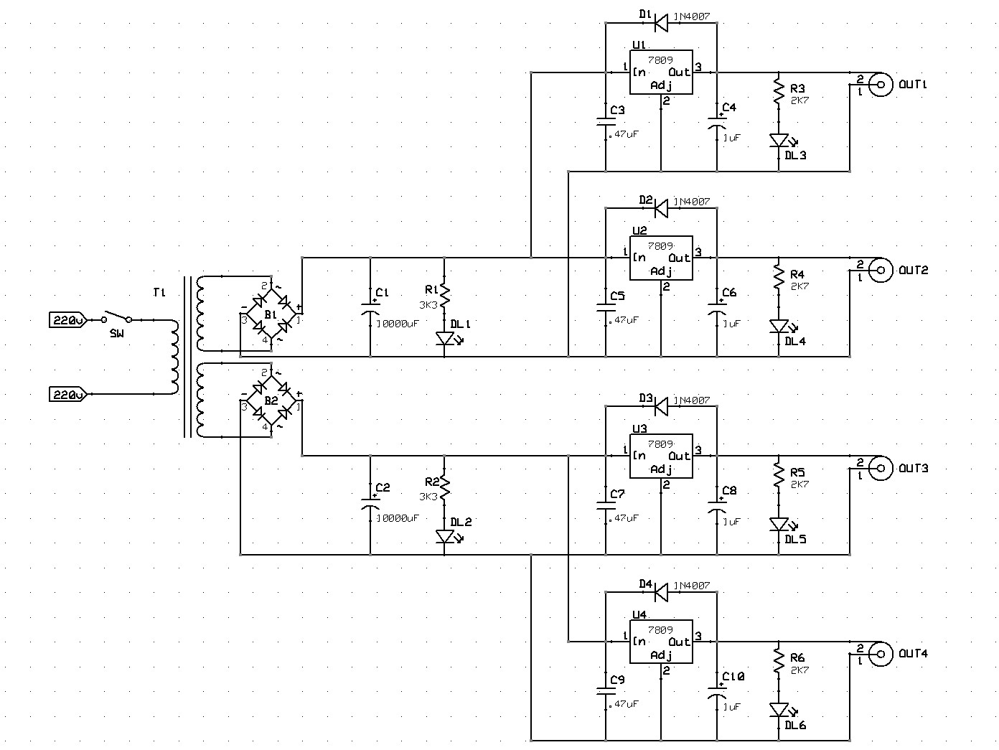

# PowerBANK-229
A simple 4-lines power supply (9 volt) bank connected to the mains. 

### Features
- power source from mains
- 2 isolated grounds
- 2 separated and regulated 9V-200mA output lines (center-negative) on each ground

### Hardware

#### Schematic:

