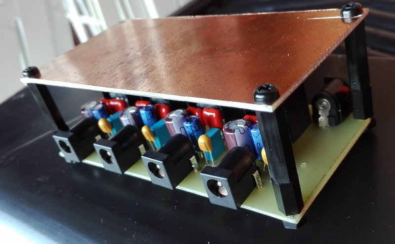
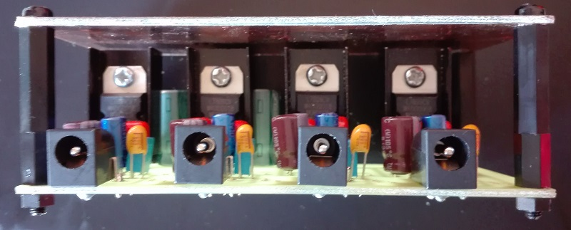
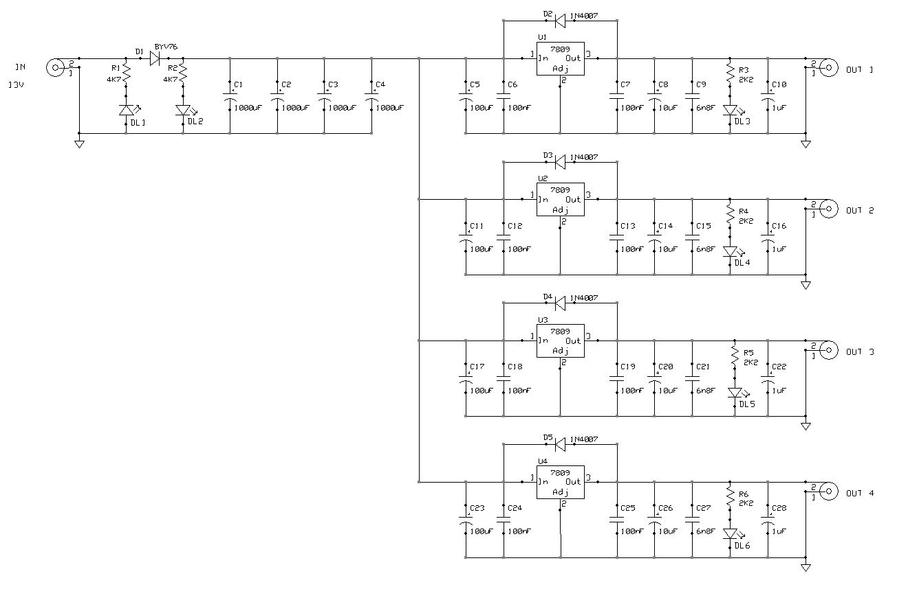
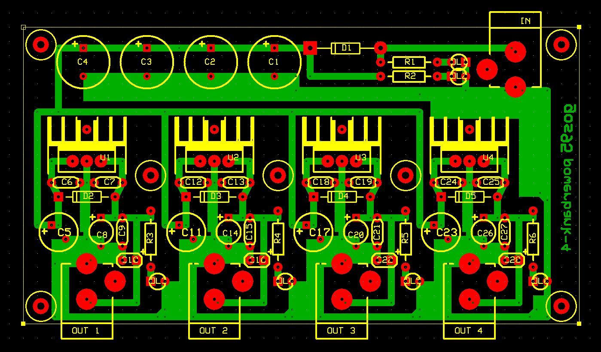

# powerBANK-4
This is an simple project for a 4-lines power supply (9 volt) bank.

## Specifications

### Features
- 12-15V AC/DC power plug for external input power supply (center-negative)
- 4 separated and regulated 9V-200mA output lines (center-negative)
- common ground between all the output lines
- DC source reverse polarity protection (with led indication)

### Hardware
Schematics and PCB layouts are designed with ExpressPCB free CAD software.

#### Schematic:

#### PCB Layout:
