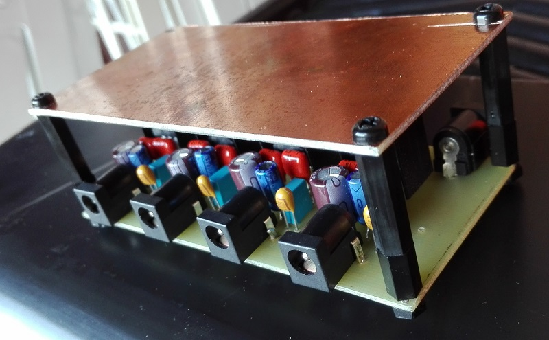
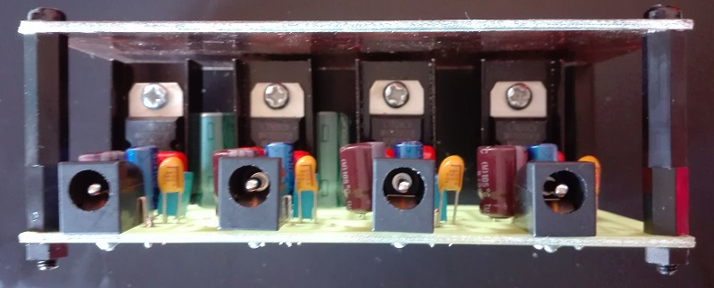
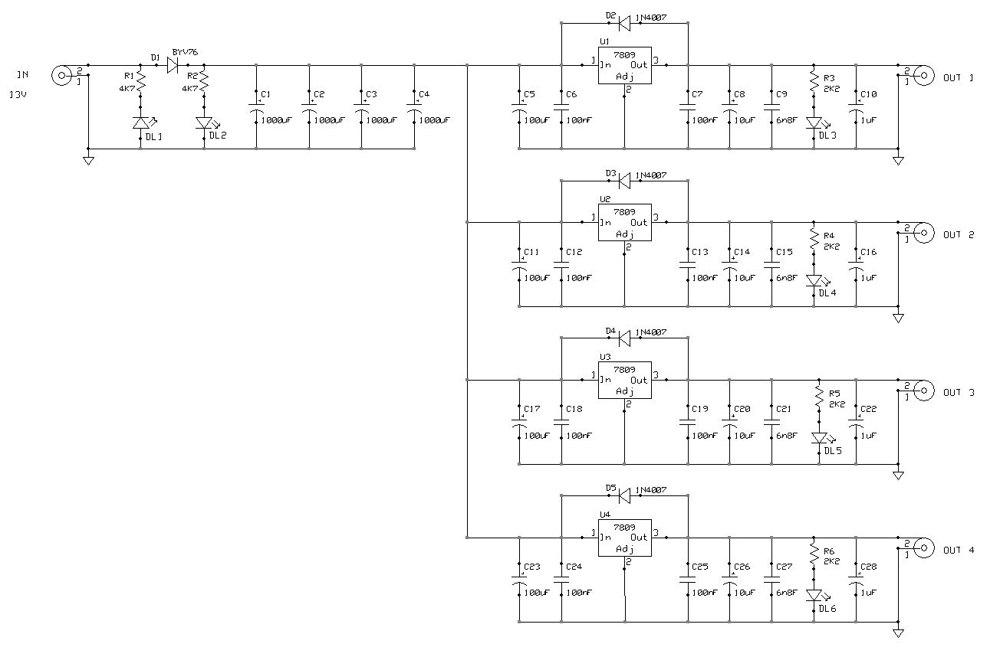
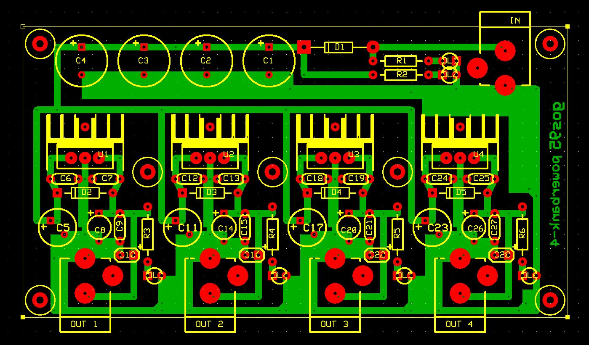

# powerBANK-4
This is an simple project for a 4-lines power supply (9 volt) bank.

## Features
- **Input**: 12-15V AC/DC (center-negative).
- **Outputs**: 4 independent regulated output providing 9V at 200mA each (center-negative).
- **Protection**: Integrated DC source reverse polarity protection with a dedicated LED indicator.
- **Grounding**: Common ground architecture across all output lines.

## Hardware Design
Schematics and PCB layouts are designed with ExpressPCB free CAD software.

#### Schematic:

#### PCB Layout:

## About & License
**Author**: Alessandro Fraschetti (gom9000). 
**License**: This experience is licensed under the [MIT License](LICENSE). The license applies to all the documentation, schematic files, and PCB layouts provided in this repository.